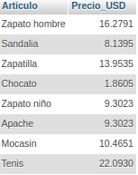
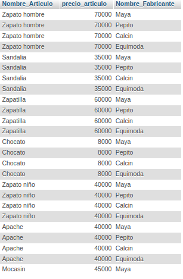

# Sistemas para una zapatería

## Modelo Entidad-Relacion

## Modelo físico de la BD

## Tabla Fabricante

## Tabla Articulo

## Consultas a la BD

1. Mostrar la lista de todos datos de los fabricantes

`SELECT * FROM Fabricante;`

2. Mostrar la lista de nombres de los Fabricantes, poniento un alias al nombre de la columna

`SELECT nombre_fabricante AS Fabricante FROM Fabricante;`

3. Mostrar los nombres de los productos.

`SELECT nombre_articulo FROM Articulo;`

4. Obtener los nombres y los precios de los productos de la tienda.

`SELECT nombre_articulo AS Nombre, precio_articulo AS Precio FROM Articulo;`

5. Obtener los nombres de los artículos cuyo precio sea superior a 50000.

`SELECT nombre_articulo FROM Articulo WHERE precio_articulo > 50000;`

6. Obtener el nombre de los artículos cuyo precio esté entre 5000 y 40000 (ambos incluidos)

### Forma 1
`SELECT nombre_articulo FROM Articulo WHERE precio_articulo >= 5000 AND precio_articulo <= 40000;`

### Forma 2
`SELECT nombre_articulo FROM Articulo WHERE precio_articulo BETWEEN 5000 AND 40000;`

7. Obtener el nombre y el precio de los artículos en dolares.

`SELECT nombre_articulo AS Articulo, precio_articulo / 4300 AS Precio USD;`

8. Mostrar el precio promedio de todos los productos.

`SELECT AVG(precio_articulo) AS precio_promedio FROM Articulo;`

9. Mostrar el precio promedio de los artículos cuyo código de fabricante sea fab02.

`SELECT AVG(precio_articulo) AS precio_promedio FROM Articulo WHERE id_fabricante = 'fab02';`

10. Obtener el número de artículos cuyo precio sea mayor o igual a $50000.

`SELECT nombre_articulo FROM Articulo WHERE precio_articulo >= 50000;`

11. Obtener el nombre y el precio de los artículos cuyo precio sea igual o mayor a $50000 y ordenarlos descendentemente por precio, y luego ascendentemente por nombre.

`SELECT nombre_articulo, precio_articulo FROM Articulo WHERE precio_articulo >= 50000 ORDER BY precio_articulo DESC, nombre_articulo ASC;`

12. Mostrar el listado completo de artículos, incluyendo por cada artículo los datos del artículo y de su fabricante.

`SELECT nombre_articulo AS Nombre_Articulo, precio_articulo, nombre_fabricante AS Nombre_Fabricante FROM Articulo JOIN Fabricante;`

